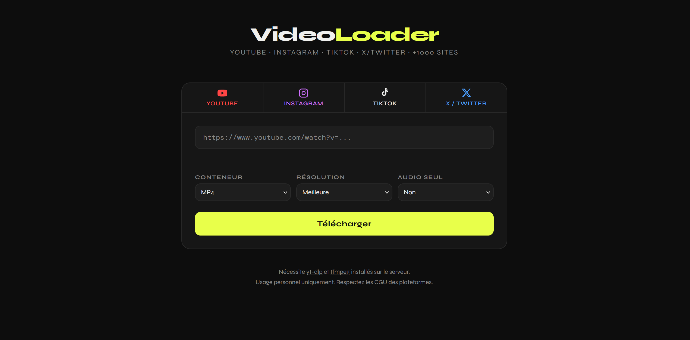

# VideoLoader

**Telechargeur de videos multi-plateformes avec interface web locale.**

Supporte YouTube, Instagram, TikTok, X/Twitter et plus de 1000 sites grace a [yt-dlp](https://github.com/yt-dlp/yt-dlp).


---



---

## Telechargement rapide

Pas besoin de Git. Telecharge directement le zip :

**[Telecharger VideoLoader (ZIP)](https://github.com/NicoVBucks/videoloader/archive/refs/heads/main.zip)**

Dezippe, suis le guide d'installation ci-dessous, c'est pret.

---

## Fonctionnalites

- Interface web sombre et moderne, accessible depuis n'importe quel navigateur
- Telechargement video en MP4, WebM ou MKV avec choix de resolution (360p a 1080p+)
- Extraction audio en MP3, M4A ou Opus
- Barre de progression et logs en temps reel
- Detection automatique de la plateforme (YouTube, Instagram, TikTok, X...)
- Raccourci Bureau avec icone personnalisable (Windows)
- Lanceur silencieux sans fenetre de terminal

---

## Prerequis

- [Python 3.9+](https://python.org/downloads)
- [ffmpeg](https://ffmpeg.org) installe sur le systeme

### Installer ffmpeg

```bash
# macOS
brew install ffmpeg

# Ubuntu / Debian
sudo apt install ffmpeg

# Windows
# 1. Telecharger depuis github.com/BtbN/FFmpeg-Builds/releases
# 2. Extraire dans C:\ffmpeg
# 3. Ajouter C:\ffmpeg\bin au PATH systeme
```

---

## Installation

```bash
# 1. Cloner le repo (ou telecharger le ZIP ci-dessus)
git clone https://github.com/[ton-pseudo]/videoloader.git
cd videoloader

# 2. Installer les dependances Python
pip install -r requirements.txt

# 3. Lancer le serveur
python -m uvicorn server:app --reload --port 8000

# 4. Ouvrir dans le navigateur
# http://localhost:8000
```

---

## Windows : raccourci avec icone

Pour lancer VideoLoader comme un vrai logiciel (sans fenetre de terminal) :

Exectuer le fichier creer_raccourci.ps1 puis valider la commande avec O.

OU

```powershell
Set-ExecutionPolicy -Scope CurrentUser Unrestricted -Force
.\creer_raccourci.ps1
```

Un raccourci VideoLoader apparait sur le Bureau. Double-clic pour lancer.

Pour personnaliser l'icone : convertis ton image sur [icoconvert.com](https://icoconvert.com), renomme-la `videoloader.ico` et remplace l'ancienne dans le dossier.

---

## API REST

| Methode | Endpoint | Description |
|---------|----------|-------------|
| `POST` | `/api/download` | Demarrer un telechargement |
| `GET` | `/api/status/{job_id}` | Progression en temps reel |
| `GET` | `/api/file/{job_id}` | Telecharger le fichier final |
| `DELETE` | `/api/job/{job_id}` | Supprimer le job |

### Exemple

```bash
curl -X POST http://localhost:8000/api/download \
  -H "Content-Type: application/json" \
  -d '{"url": "https://youtube.com/watch?v=...", "format": "mp4", "resolution": "720"}'
```

---

## Stack technique

- **Backend** : Python, FastAPI, Uvicorn
- **Telechargement** : yt-dlp
- **Post-traitement** : ffmpeg
- **Frontend** : HTML / CSS / JS vanilla

---

## Avertissement legal

Cet outil est destine a un **usage personnel uniquement**. Le telechargement de contenus protegees par le droit d'auteur sans autorisation peut etre illegal dans votre pays. Respectez les conditions d'utilisation des plateformes.

---

## Licence

MIT - voir [LICENSE](LICENSE)
